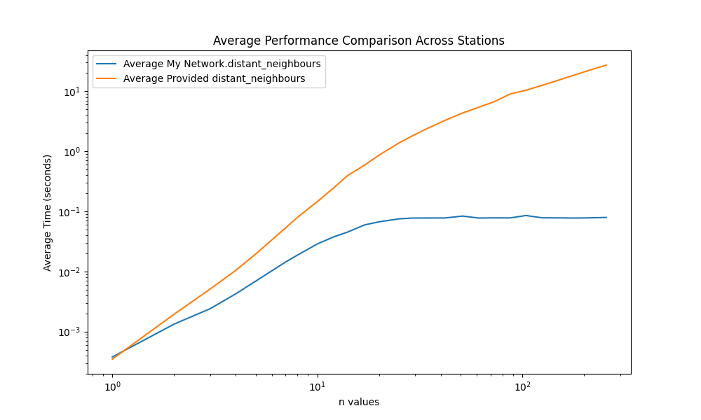

## Times for Station 10
|   N Value |   New Method Time (s) |   Provided Method Time (s) |
|----------:|----------------------:|---------------------------:|
|         1 |             0.000398  |                  0.0003475 |
|         2 |             0.0021983 |                  0.0033026 |
|         3 |             0.0045473 |                  0.009305  |
|         4 |             0.0084708 |                  0.0210552 |
|         5 |             0.0146781 |                  0.0412036 |
|         7 |             0.0259632 |                  0.1033    |
|         8 |             0.0320572 |                  0.148222  |
|        10 |             0.0422472 |                  0.245463  |
|        12 |             0.0625055 |                  0.401505  |
|        14 |             0.0628478 |                  0.57409   |
|        17 |             0.0715106 |                  0.857704  |
|        20 |             0.0763579 |                  1.20908   |
|        25 |             0.0775694 |                  1.7561    |
|        29 |             0.0774576 |                  2.17571   |
|        35 |             0.0773692 |                  2.86167   |
|        42 |             0.077514  |                  3.66333   |
|        51 |             0.077248  |                  4.83799   |
|        61 |             0.0781927 |                  5.78144   |
|        73 |             0.081392  |                  7.11607   |
|        87 |             0.0773486 |                  8.5751    |
|       104 |             0.0772766 |                 10.5031    |
|       125 |             0.0772899 |                 12.8678    |
|       149 |             0.0775599 |                 15.4867    |
|       179 |             0.0774882 |                 18.6354    |
|       214 |             0.0777898 |                 22.5132    |
|       256 |             0.0776923 |                 26.427     |
## Times for Station 24
|   N Value |   New Method Time (s) |   Provided Method Time (s) |
|----------:|----------------------:|---------------------------:|
|         1 |             0.0003713 |                  0.0003731 |
|         2 |             0.0009442 |                  0.0012994 |
|         3 |             0.0014037 |                  0.0032919 |
|         4 |             0.0029062 |                  0.0059052 |
|         5 |             0.0048522 |                  0.011798  |
|         7 |             0.0137478 |                  0.0415578 |
|         8 |             0.0185158 |                  0.0664386 |
|        10 |             0.0288208 |                  0.138419  |
|        12 |             0.04002   |                  0.241242  |
|        14 |             0.0517462 |                  0.375125  |
|        17 |             0.0656236 |                  0.624909  |
|        20 |             0.0752664 |                  0.946788  |
|        25 |             0.0826495 |                  1.50271   |
|        29 |             0.0820936 |                  1.9146    |
|        35 |             0.0776045 |                  2.57958   |
|        42 |             0.0785031 |                  3.36328   |
|        51 |             0.0775321 |                  4.40454   |
|        61 |             0.0778421 |                  5.49798   |
|        73 |             0.0781171 |                  6.84869   |
|        87 |             0.0788574 |                  8.32657   |
|       104 |             0.0776114 |                 10.2775    |
|       125 |             0.0775887 |                 12.6381    |
|       149 |             0.078409  |                 15.292     |
|       179 |             0.0774942 |                 18.6768    |
|       214 |             0.0776893 |                 22.5082    |
|       256 |             0.081624  |                 27.4698    |
## Times for Station 56
|   N Value |   New Method Time (s) |   Provided Method Time (s) |
|----------:|----------------------:|---------------------------:|
|         1 |             0.0003697 |                  0.0003313 |
|         2 |             0.0006219 |                  0.0010922 |
|         3 |             0.0008889 |                  0.0019524 |
|         4 |             0.0011439 |                  0.0032272 |
|         5 |             0.0014033 |                  0.0048328 |
|         7 |             0.0019253 |                  0.0090379 |
|         8 |             0.0021871 |                  0.0126848 |
|        10 |             0.0032424 |                  0.0188577 |
|        12 |             0.0059515 |                  0.0318234 |
|        14 |             0.0103696 |                  0.0558646 |
|        17 |             0.0252901 |                  0.135633  |
|        20 |             0.0410646 |                  0.29146   |
|        25 |             0.0654975 |                  0.666574  |
|        29 |             0.0751055 |                  1.07537   |
|        35 |             0.0776304 |                  1.7483    |
|        42 |             0.0772212 |                  2.72057   |
|        51 |             0.128632  |                  3.96207   |
|        61 |             0.0770482 |                  4.60819   |
|        73 |             0.0771399 |                  5.9912    |
|        87 |             0.0772701 |                  7.58753   |
|       104 |             0.0807653 |                  9.4663    |
|       125 |             0.0777017 |                 11.749     |
|       149 |             0.0782048 |                 14.443     |
|       179 |             0.0775224 |                 18.2042    |
|       214 |             0.0779966 |                 21.6631    |
|       256 |             0.0787319 |                 26.3479    |
## Times for Station 73
|   N Value |   New Method Time (s) |   Provided Method Time (s) |
|----------:|----------------------:|---------------------------:|
|         1 |             0.0003778 |                  0.0003399 |
|         2 |             0.0019396 |                  0.0026017 |
|         3 |             0.0030058 |                  0.0068047 |
|         4 |             0.0054167 |                  0.0129903 |
|         5 |             0.0085815 |                  0.0276886 |
|         7 |             0.0173222 |                  0.0758081 |
|         8 |             0.0221995 |                  0.112458  |
|        10 |             0.0395276 |                  0.168738  |
|        12 |             0.0449692 |                  0.309463  |
|        14 |             0.0551668 |                  0.705219  |
|        17 |             0.0816597 |                  0.718848  |
|        20 |             0.0724764 |                  0.992206  |
|        25 |             0.0784872 |                  1.54925   |
|        29 |             0.0775841 |                  1.95352   |
|        35 |             0.0778239 |                  2.64374   |
|        42 |             0.0772892 |                  3.41408   |
|        51 |             0.0783243 |                  4.38837   |
|        61 |             0.0770246 |                  5.47737   |
|        73 |             0.0773916 |                  6.83108   |
|        87 |             0.0769286 |                  8.42403   |
|       104 |             0.0773766 |                 10.2399    |
|       125 |             0.0775048 |                 12.5836    |
|       149 |             0.0771737 |                 15.1929    |
|       179 |             0.076784  |                 18.5187    |
|       214 |             0.0772739 |                 22.3792    |
|       256 |             0.0772921 |                 27.0383    |
## Times for Station 83
|   N Value |   New Method Time (s) |   Provided Method Time (s) |
|----------:|----------------------:|---------------------------:|
|         1 |             0.0003722 |                  0.0003742 |
|         2 |             0.0011443 |                  0.0016272 |
|         3 |             0.0019281 |                  0.0043678 |
|         4 |             0.0035417 |                  0.00908   |
|         5 |             0.006644  |                  0.0182318 |
|         7 |             0.0165004 |                  0.052521  |
|         8 |             0.0214243 |                  0.0833352 |
|        10 |             0.032867  |                  0.170979  |
|        12 |             0.0430725 |                  0.283254  |
|        14 |             0.0534587 |                  0.418349  |
|        17 |             0.0661335 |                  0.693458  |
|        20 |             0.0739718 |                  0.993148  |
|        25 |             0.0763616 |                  1.54392   |
|        29 |             0.0771575 |                  1.97652   |
|        35 |             0.0773807 |                  2.65976   |
|        42 |             0.0771451 |                  3.46665   |
|        51 |             0.0773489 |                  4.45456   |
|        61 |             0.0762383 |                  5.6008    |
|        73 |             0.077454  |                  6.90188   |
|        87 |             0.0780586 |                  9.441     |
|       104 |             0.0775152 |                 10.3482    |
|       125 |             0.0773482 |                 12.6943    |
|       149 |             0.0776814 |                 15.3362    |
|       179 |             0.0773981 |                 18.7423    |
|       214 |             0.081512  |                 22.5818    |
|       256 |             0.0774384 |                 27.8083    |
## Times for Station 94
|   N Value |   New Method Time (s) |   Provided Method Time (s) |
|----------:|----------------------:|---------------------------:|
|         1 |             0.0003719 |                  0.0003577 |
|         2 |             0.001404  |                  0.0019498 |
|         3 |             0.0024721 |                  0.0049189 |
|         4 |             0.0045363 |                  0.0107664 |
|         5 |             0.0069156 |                  0.0190673 |
|         7 |             0.0133962 |                  0.0512145 |
|         8 |             0.0187947 |                  0.0767104 |
|        10 |             0.0323995 |                  0.160293  |
|        12 |             0.0418742 |                  0.275751  |
|        14 |             0.0507793 |                  0.405717  |
|        17 |             0.0638433 |                  0.649208  |
|        20 |             0.0738102 |                  0.945873  |
|        25 |             0.0771277 |                  1.49613   |
|        29 |             0.0773546 |                  1.93063   |
|        35 |             0.077068  |                  2.59869   |
|        42 |             0.0777734 |                  3.38946   |
|        51 |             0.0772639 |                  4.37816   |
|        61 |             0.077375  |                  5.57352   |
|        73 |             0.0773766 |                  6.78734   |
|        87 |             0.0773016 |                  8.41029   |
|       104 |             0.0773628 |                 10.3335    |
|       125 |             0.0772369 |                 12.6842    |
|       149 |             0.080462  |                 15.3068    |
|       179 |             0.0772091 |                 18.7347    |
|       214 |             0.0775486 |                 22.5709    |
|       256 |             0.0779387 |                 27.2039    |
## Times for Station 144
|   N Value |   New Method Time (s) |   Provided Method Time (s) |
|----------:|----------------------:|---------------------------:|
|         1 |             0.0003835 |                  0.0003411 |
|         2 |             0.002193  |                  0.0033309 |
|         3 |             0.0045498 |                  0.0095721 |
|         4 |             0.0076575 |                  0.0202569 |
|         5 |             0.0120262 |                  0.0329987 |
|         7 |             0.0241466 |                  0.088889  |
|         8 |             0.0300219 |                  0.133332  |
|        10 |             0.0407572 |                  0.235997  |
|        12 |             0.0501366 |                  0.368642  |
|        14 |             0.0588706 |                  0.533574  |
|        17 |             0.0711028 |                  0.807962  |
|        20 |             0.0759393 |                  1.16081   |
|        25 |             0.0778608 |                  1.69192   |
|        29 |             0.0771934 |                  2.18221   |
|        35 |             0.0772787 |                  2.7685    |
|        42 |             0.0775498 |                  3.5888    |
|        51 |             0.0774846 |                  4.58906   |
|        61 |             0.0774137 |                  5.67844   |
|        73 |             0.0771546 |                  6.98711   |
|        87 |             0.0775805 |                 13.9171    |
|       104 |             0.143128  |                 12.3528    |
|       125 |             0.0828054 |                 13.313     |
|       149 |             0.0775895 |                 15.7275    |
|       179 |             0.0780882 |                 19.1434    |
|       214 |             0.0781032 |                 23.9382    |
|       256 |             0.0878132 |                 28.4002    |
## Times for Station 168
|   N Value |   New Method Time (s) |   Provided Method Time (s) |
|----------:|----------------------:|---------------------------:|
|         1 |             0.0003805 |                  0.0003323 |
|         2 |             0.0006291 |                  0.0009764 |
|         3 |             0.0008895 |                  0.0022065 |
|         4 |             0.0013147 |                  0.0032276 |
|         5 |             0.0014098 |                  0.0055345 |
|         7 |             0.0019299 |                  0.010327  |
|         8 |             0.0021934 |                  0.0116569 |
|        10 |             0.0027203 |                  0.0177739 |
|        12 |             0.0040167 |                  0.0285496 |
|        14 |             0.0072935 |                  0.0470946 |
|        17 |             0.0210304 |                  0.107953  |
|        20 |             0.0380646 |                  0.243109  |
|        25 |             0.0629092 |                  0.614996  |
|        29 |             0.0750767 |                  1.02492   |
|        35 |             0.078706  |                  1.70142   |
|        42 |             0.079309  |                  2.49242   |
|        51 |             0.0811586 |                  3.50932   |
|        61 |             0.0787088 |                  4.63532   |
|        73 |             0.0783378 |                  5.95466   |
|        87 |             0.0790992 |                  7.58512   |
|       104 |             0.0794385 |                  9.37316   |
|       125 |             0.0776594 |                 11.7043    |
|       149 |             0.0772305 |                 14.371     |
|       179 |             0.0772441 |                 17.7243    |
|       214 |             0.0771986 |                 21.8868    |
|       256 |             0.076506  |                 26.2185    |
## Times for Station 265
|   N Value |   New Method Time (s) |   Provided Method Time (s) |
|----------:|----------------------:|---------------------------:|
|         1 |             0.0003768 |                  0.0003373 |
|         2 |             0.0008944 |                  0.0013074 |
|         3 |             0.0019387 |                  0.0035773 |
|         4 |             0.0032671 |                  0.0075224 |
|         5 |             0.0056003 |                  0.014445  |
|         7 |             0.0145006 |                  0.047426  |
|         8 |             0.0213264 |                  0.0727391 |
|        10 |             0.0361697 |                  0.157641  |
|        12 |             0.045945  |                  0.272529  |
|        14 |             0.0552736 |                  0.414593  |
|        17 |             0.0703904 |                  0.711522  |
|        20 |             0.0765901 |                  0.994856  |
|        25 |             0.0772897 |                  1.55009   |
|        29 |             0.0772999 |                  2.00292   |
|        35 |             0.0774196 |                  2.65486   |
|        42 |             0.0764549 |                  3.42726   |
|        51 |             0.076743  |                  4.45519   |
|        61 |             0.0772615 |                  5.57294   |
|        73 |             0.0773992 |                  6.92457   |
|        87 |             0.0772577 |                  8.43611   |
|       104 |             0.0772757 |                 10.2843    |
|       125 |             0.0774593 |                 12.7581    |
|       149 |             0.0769438 |                 15.303     |
|       179 |             0.077427  |                 18.6158    |
|       214 |             0.0774047 |                 22.5897    |
|       256 |             0.0775806 |                 27.3481    |

Graph we obtain:

For how make it more efficient

1.Boolean Flags: Uses a list of boolean flags (visited) to track whether each node has been visited. This approach is more efficient than maintaining and checking a list of nodes.

2.Set for Current Level Nodes: Utilizes a set (current_level) to keep track of nodes at the current distance from the starting node. Sets efficiently handle uniqueness and quick lookups.

3.Iterative Exploration: Iteratively explores nodes at increasing distances. For each node in the current level, it looks at its neighbors and adds unvisited neighbors to the next level.

4.Avoid Revisiting Nodes: Marks nodes as visited as soon as they are added to the next level, preventing revisits and unnecessary checks.

5.Handling the Starting Node: Initially considers the starting node as visited. If n > 0, it ensures the starting node is not included in the final list of neighbors.

6.Extracting Neighbors: After iterating through n levels, it compiles a list of visited nodes (excluding the starting node if n > 0), which are the n-distant neighbors.

7.List Comprehension for Final Result: A list comprehension is used to efficiently compile the final list of neighbors from the visited array, ensuring that only visited nodes (except the initial node, if n > 0) are included.

So for this result, we find that the time taken for provided method increases with n increasing. But for our method in network class, when n goes to 120, the time taken almost keep a straight line. 
It means that our method use the information we obtain before when n goes to large, so it saves much computation on it and less time than provided one.

We also do some other investigation on other data . This one has 100*100 dimension and we also find that our method is faster. 

[[0. 7. 0. ... 7. 0. 6.]
 [7. 0. 0. ... 0. 9. 1.]
 [0. 0. 0. ... 0. 0. 2.]
 ...
 [7. 0. 0. ... 5. 0. 6.]
 [0. 9. 0. ... 0. 0. 5.]
 [6. 1. 2. ... 6. 5. 0.]]

Network.distant_neighbours: 0.010352199984481558 seconds

provided_distant_neighbours: 0.12070360002689995 seconds

This one is 200*200 matrix and we want to test whether the data we obtain before depends on the web query. These data show us our method exactly faster than provided method.

[[ 0.  0. 10. ...  1.  3.  0.]
 [ 0.  7.  0. ...  0.  1.  7.]
 [10.  0.  6. ...  4.  0.  0.]
 ...
 [ 1.  0.  4. ...  1.  4.  1.]
 [ 3.  1.  0. ...  4.  0.  0.]
 [ 0.  7.  0. ...  1.  0.  0.]]

Network.distant_neighbours: 0.03842880000593141 seconds

provided_distant_neighbours: 0.8361856999981683 seconds

Here is the code to build and calculate the time of them:

import timeit
import numpy as np
from network import Network
from distant_neighbours import provided_distant_neighbours

size = 200
adj_matrix = np.zeros((size, size))

num_non_zero_entries = size * size // 4

non_zero_indices = np.random.choice(size * size, num_non_zero_entries, replace=False)
for idx in non_zero_indices:
    i, j = divmod(idx, size)
    adj_matrix[i, j] = np.random.randint(1, 11) 
    adj_matrix[j, i] = adj_matrix[i, j]  

print(adj_matrix)

network = Network(adj_matrix)

time_network = timeit.timeit(lambda: network.distant_neighbours(5, 80), number=10)

time_provided = timeit.timeit(lambda: provided_distant_neighbours(5, 80, adj_matrix), number=10)

print(f"Network.distant_neighbours: {time_network} seconds")

print(f"provided_distant_neighbours: {time_provided} seconds")

Package we used: numpy,timeit,requests,matplotlib,pandas,urllib

We obtain data by timeit,so it get 10 times and get their average to have a stable data, and then use 9 station average to get the data to form this graph.
